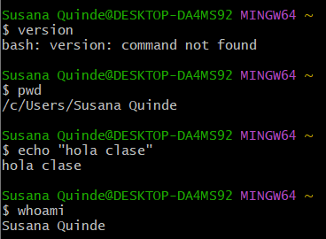
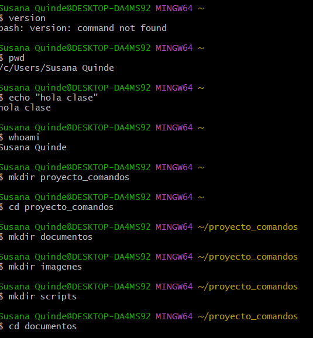
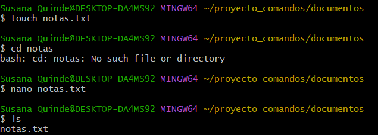
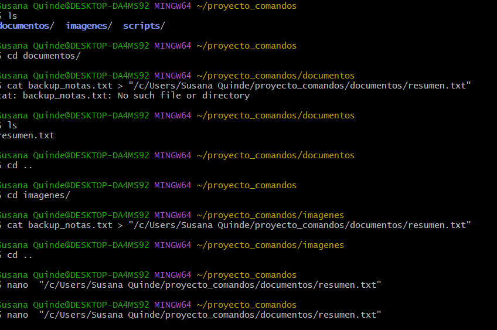
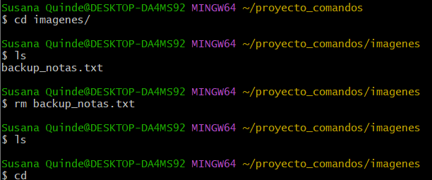
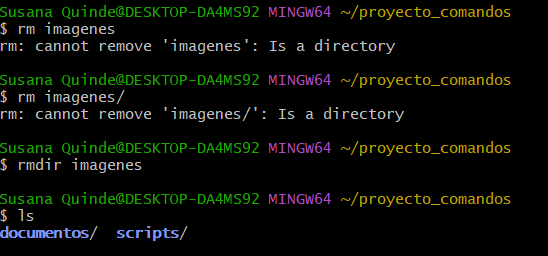
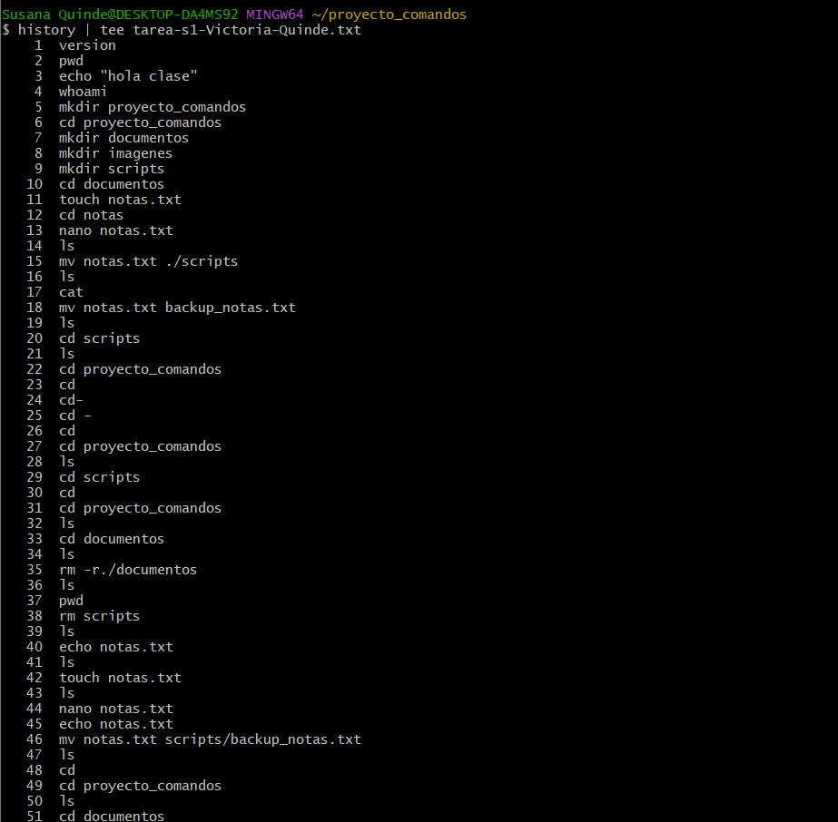
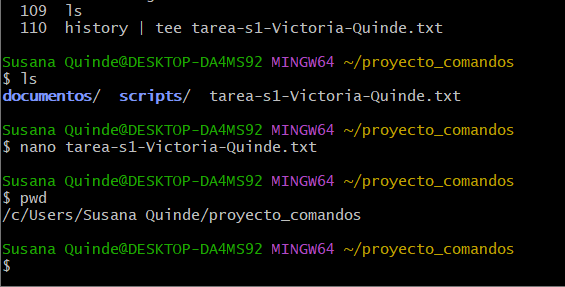

# Practica servidor web
## 1. Titulo
Comandos basicos en linux 
## 2. Tiempo de duración
6 horas 
## 3. Fundamentos:

Linux: La terminal de Linux es una interfaz en modo texto que permite al usuario interactuar con el sistema operativo mediante comandos. Es una herramienta poderosa para ejecutar programas, mover archivos, instalar software y mucho más, sin necesidad de usar ventanas gráficas.

GitBash:Git Bash es una aplicación para Windows que proporciona una terminal similar a Linux. Incluye las herramientas de Git (un sistema de control de versiones) y también permite ejecutar muchos comandos de Unix/Linux. Es útil para programadores que trabajan en proyectos con Git desde Windows.

Servidor: Un servidor es una computadora (física o virtual) que provee servicios o recursos a otras computadoras, llamadas clientes. Por ejemplo, un servidor web entrega páginas web; un servidor de archivos permite almacenar y compartir documentos, etc. Los servidores suelen estar siempre encendidos y conectados a una red.

Comandos:  Los comandos son instrucciones escritas por el usuario en la terminal para que el sistema operativo realice una tarea. Por ejemplo, ls muestra los archivos en una carpeta, cd cambia de directorio, rm borra archivos, etc. Son la base del trabajo en la terminal de Linux.

## 4. Conocimientos previos.
   
Para realizar esta practica el estudiante necesita tener claro los siguientes temas:
- Comandos linux.
- Manejo de navegador
- Entorno en el que se va a trabajar 
- Terminal linux en gitBash

## 5. Objetivos a alcanzar
   
- Crear de directorios para poder organizar un arbol.
- Crear Archivos para poder escribir documentacion necesaria para la configuracion.
- Modificar contenido de archivos para poder ir agragando informacion que va surgiendo.
- Cambiar archivos de directorio
- Eliminar Carpetas y archivos  
  
## 6. Equipo necesario:
  
- Computador con sistema operativo Windows/Linux
- GitBash

## 7. Material de apoyo.
   
- Documentacion de tendencias tecnologicas.
- GitBash
- Video ilustrativo
- Documentacion sobre comandos basicos de linux
  
## 8. Procedimiento

Paso 1:ver en que usuario estoy  

Paso 2: creacion de directorio

paso 3: creacion de archivos

paso 4: modificacion de archivos(nombre, contenido, ruta)

paso 5: eliminacion de archivo

paso 6: eliminacion de carpeta

paso 7: creacion de historial

paso 8: Verificacion del tutorial

## 9. Resultados esperados:
    
Al finalizar esta practica se pudo evidenciar la importancia de la practica de comandos basicos para poder movernos enun entorno de configuracion de servidores.

## 10. Bibliografía
    
- Shotts, W. E. (2019). The Linux command line: A complete introduction (2nd ed.). No Starch Press.

- Chacon, S., & Straub, B. (2014). Pro Git (2nd ed.). Apress. https://git-scm.com/book/en/v2

- Ghazal, B. (2020). Linux basics for hackers: Getting started with networking, scripting, and security in Kali. No Starch Press.

audio:

<audio controls>
  <source src="media/nota.ogg" type="audio/ogg">
 
</audio>
